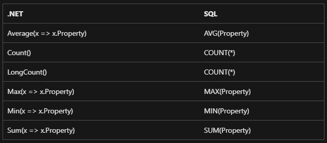
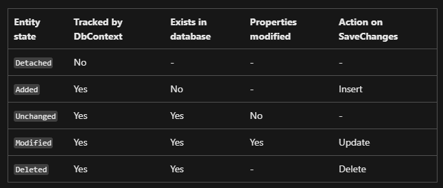

# Basics

**Entity Framework (EF) Basics:**

- **ORM (Object-Relational Mapping):** EF is an ORM that allows you to use C# objects to interact with a database.
- **DbContext:** The primary class that coordinates EF functionality for a given data model.
- **DbSet:** Represents a collection of entities of a specific type that you can query and save.

**Key Concepts:**

- **Code-First Approach:** You write C# classes first and EF creates the database.
- **Database-First Approach:** You create the database first and EF generates the C# classes.
- **Migrations:** Allow you to update the database schema to match your data model changes.

**Performance Tips:**

- **Lazy Loading:** Only load data when it's needed, but be aware of the N+1 queries issue.
- **Eager Loading:** Use `Include()` to load related data in the initial query to avoid separate queries.
- **AsNoTracking():** Use this method when you only need to read data without updating it for better performance.

**Advanced Features:**

- **Fluent API:** Configures EF using method calls rather than attributes.
- **Shadow Properties:** Properties that are not defined in your C# class but are present in the database.
- **Global Query Filters:** Apply filters to all queries of a certain entity type.

**Interview Tips:**

- Understand the difference between **EF 6** and **EF Core**.
- Be prepared to explain how to handle **concurrency conflicts**.
- Know how to implement **repository and unit of work patterns**.

# Table Definitions

**define a single table**

```csharp
public class User
{
    public int Id { get; set; }
    public string UserName { get; set; }
    public string Email { get; set; }
}
```

**custom table naming, specifying schema, or maybe add a comment for table to show in sql server**

```csharp
[Table("blogs", Schema = "blogging")]
[Comment("Blogs managed on the website")]
public class Blog
{
    public int BlogId { get; set; }
    public string Url { get; set; }
}
```

**view mapping**

```csharp
modelBuilder.Entity<Blog>().ToView("blogsView", schema: "blogging");
```

**table valued function mapping**

```csharp
public class BlogWithMultiplePosts
{
    public string Url { get; set; }
    public int PostCount { get; set; }
}
```

```sql
CREATE FUNCTION dbo.BlogsWithMultiplePosts()
RETURNS TABLE
AS
RETURN
(
    SELECT b.Url, COUNT(p.BlogId) AS PostCount
    FROM Blogs AS b
    JOIN Posts AS p ON b.BlogId = p.BlogId
    GROUP BY b.BlogId, b.Url
    HAVING COUNT(p.BlogId) > 1
)
```

**exclude a property from the model**

```csharp
public class Blog
{
    public int BlogId { get; set; }
    public string Url { get; set; }

    [NotMapped]
    public DateTime LoadedFromDatabase { get; set; }
}
```

**custom column name**

```csharp
public class Blog
{
    [Column("blog_id")]
    public int BlogId { get; set; }

    public string Url { get; set; }
}
```

**specifying column data types in db**

```csharp
public class Blog
{
    public int BlogId { get; set; }

    [Column(TypeName = "varchar(200)")]
    public string Url { get; set; }

    [Column(TypeName = "decimal(5, 2)")]
    public decimal Rating { get; set; }
}
```

**string max length**

```csharp
public class Blog
{
    public int BlogId { get; set; }

    [MaxLength(500)]
    public string Url { get; set; }
}
```

**required columns**

```csharp
public class CustomerWithoutNullableReferenceTypes
{
    public int Id { get; set; }

    [Required] // Data annotations needed to configure as required
    public string FirstName { get; set; }

    [Required] // Data annotations needed to configure as required
    public string LastName { get; set; }

    public string MiddleName { get; set; } // Optional by convention
}
public class Customer
{
    public int Id { get; set; }
    public string FirstName { get; set; } // Required by convention
    public string LastName { get; set; } // Required by convention
    public string? MiddleName { get; set; } // Optional by convention

    // Note the following use of constructor binding, which avoids compiled warnings
    // for uninitialized non-nullable properties.
    public Customer(string firstName, string lastName, string? middleName = null)
    {
        FirstName = firstName;
        LastName = lastName;
        MiddleName = middleName;
    }
}
```

**primary key**
**_By convention, a property named Id or XXX + Id will be configured as the primary key of an entity._**

```csharp
internal class Car
{
    public string Id { get; set; }

    public string Make { get; set; }
    public string Model { get; set; }
}
internal class Truck
{
    public string TruckId { get; set; }

    public string Make { get; set; }
    public string Model { get; set; }
}
```

**non value generated pk (application must set value for this kind of pks)**

```csharp
public class Blog
{
    [DatabaseGenerated(DatabaseGeneratedOption.None)]
    public int BlogId { get; set; }

    public string Url { get; set; }
}
```

**default value**
**_On relational databases, a column can be configured with a default value; if a row is inserted without a value for that column, the default value will be used._**

```csharp
protected override void OnModelCreating(ModelBuilder modelBuilder)
{
    modelBuilder.Entity<Blog>()
        .Property(b => b.Rating)
        .HasDefaultValue(3);
}
protected override void OnModelCreating(ModelBuilder modelBuilder)
{
    modelBuilder.Entity<Blog>()
        .Property(b => b.Created)
        .HasDefaultValueSql("getdate()");
}
```

**virtual computed columns (calculates on every fetch of the data)**

```csharp
modelBuilder.Entity<Person>()
    .Property(p => p.DisplayName)
    .HasComputedColumnSql("[LastName] + ', ' + [FirstName]");
```

**persisted computed column**

```csharp
modelBuilder.Entity<Person>()
    .Property(p => p.NameLength)
    .HasComputedColumnSql("LEN([LastName]) + LEN([FirstName])", stored: true);
```

# Relations

**required one to one relation**

```csharp
// Principal (parent)
public class Blog
{
    public int Id { get; set; }
    public BlogHeader? Header { get; set; } // Reference navigation to dependent
}

// Dependent (child)
public class BlogHeader
{
    public int Id { get; set; }
    public int BlogId { get; set; } // Required foreign key property
    public Blog Blog { get; set; } = null!; // Required reference navigation to principal
}
```

**optional one to one relation**

```csharp
// Principal (parent)
public class Blog
{
    public int Id { get; set; }
    public BlogHeader? Header { get; set; } // Reference navigation to dependent
}

// Dependent (child)
public class BlogHeader
{
    public int Id { get; set; }
    public int? BlogId { get; set; } // Optional foreign key property
    public Blog? Blog { get; set; } // Optional reference navigation to principal
}
```

**required one to many relation**

```csharp
// Principal (parent)
public class Blog
{
    public int Id { get; set; }
    public ICollection<Post> Posts { get; } = new List<Post>(); // Collection navigation containing dependents
}

// Dependent (child)
public class Post
{
    public int Id { get; set; }
    public int BlogId { get; set; } // Required foreign key property
    public Blog Blog { get; set; } = null!; // Required reference navigation to principal
}
```

**optional one to many relation**

```csharp
// Principal (parent)
public class Blog
{
    public int Id { get; set; }
    public ICollection<Post> Posts { get; } = new List<Post>(); // Collection navigation containing dependents
}

// Dependent (child)
public class Post
{
    public int Id { get; set; }
    public int? BlogId { get; set; } // Optional foreign key property
    public Blog? Blog { get; set; } // Optional reference navigation to principal
}
```

**basic many to many relation**

```csharp
public class Post
{
    public int Id { get; set; }
    public List<Tag> Tags { get; } = [];
}

public class Tag
{
    public int Id { get; set; }
    public List<Post> Posts { get; } = [];
}
```

result in database will be:

```sql
CREATE TABLE "Posts" (
    "Id" INTEGER NOT NULL CONSTRAINT "PK_Posts" PRIMARY KEY AUTOINCREMENT);

CREATE TABLE "Tags" (
    "Id" INTEGER NOT NULL CONSTRAINT "PK_Tags" PRIMARY KEY AUTOINCREMENT);

CREATE TABLE "PostTag" (
    "PostsId" INTEGER NOT NULL,
    "TagsId" INTEGER NOT NULL,
    CONSTRAINT "PK_PostTag" PRIMARY KEY ("PostsId", "TagsId"),
    CONSTRAINT "FK_PostTag_Posts_PostsId" FOREIGN KEY ("PostsId") REFERENCES "Posts" ("Id") ON DELETE CASCADE,
    CONSTRAINT "FK_PostTag_Tags_TagsId" FOREIGN KEY ("TagsId") REFERENCES "Tags" ("Id") ON DELETE CASCADE);
```

# Indexes

**composite indexes (An index can also span more than one column)**
**_Indexes over multiple columns, also known as composite indexes, speed up queries which filter on index's columns, but also queries which only filter on the first columns covered by the index._**

```csharp
[Index(nameof(FirstName), nameof(LastName))]
public class Person
{
    public int PersonId { get; set; }
    public string FirstName { get; set; }
    public string LastName { get; set; }
}
```

**unique index**

```csharp
[Index(nameof(Url), IsUnique = true)]
public class Blog
{
    public int BlogId { get; set; }
    public string Url { get; set; }
}
```

**index sort order**

```csharp
[Index(nameof(Url), nameof(Rating), IsDescending = new[] { false, true })]
public class Blog
{
    public int BlogId { get; set; }
    public string Url { get; set; }
    public int Rating { get; set; }
}
[Index(nameof(Url), nameof(Rating), AllDescending = true)]
public class Blog
{
    public int BlogId { get; set; }
    public string Url { get; set; }
    public int Rating { get; set; }
}
```

**index naming**

```csharp
[Index(nameof(Url), Name = "Index_Url")]
public class Blog
{
    public int BlogId { get; set; }
    public string Url { get; set; }
}
```

**index filter (improve performance and also index storage)**

```csharp
protected override void OnModelCreating(ModelBuilder modelBuilder)
{
    modelBuilder.Entity<Blog>()
        .HasIndex(b => b.Url)
        .HasFilter("[Url] IS NOT NULL");
}
protected override void OnModelCreating(ModelBuilder modelBuilder)
{
    modelBuilder.Entity<Blog>()
        .HasIndex(b => b.Url)
        .IsUnique()
        .HasFilter(null);
}
```

**included columns**

```csharp
protected override void OnModelCreating(ModelBuilder modelBuilder)
{
    modelBuilder.Entity<Post>()
        .HasIndex(p => p.Url)
        .IncludeProperties(
            p => new { p.Title, p.PublishedOn });
}
```

**check constraints**

```csharp
protected override void OnModelCreating(ModelBuilder modelBuilder)
{
    modelBuilder
        .Entity<Product>()
        .ToTable(b => b.HasCheckConstraint("CK_Prices", "[Price] > [DiscountedPrice]"));
}
```

# sequence

**_Sequences are a feature typically supported only by relational databases. If you're using a non-relational database such as Azure Cosmos DB, check your database documentation on generating unique values._**
**_A sequence generates unique, sequential numeric values in the database. Sequences are not associated with a specific table, and multiple tables can be set up to draw values from the same sequence._**

```csharp
protected override void OnModelCreating(ModelBuilder modelBuilder)
{
    modelBuilder.HasSequence<int>("OrderNumbers", schema: "shared")
        .StartsAt(1000)
        .IncrementsBy(1);

    modelBuilder.Entity<Order>()
        .Property(o => o.OrderNo)
        .HasDefaultValueSql("NEXT VALUE FOR OrderNumbers");
}
```

**keyless entity type**

Some of the main usage scenarios for keyless entity types are:

Serving as the return type for SQL queries.

Mapping to database views that do not contain a primary key.

Mapping to tables that do not have a primary key defined.

Mapping to queries defined in the model.

```csharp
[Keyless]
public class BlogPostsCount
{
    public string BlogName { get; set; }
    public int PostCount { get; set; }
}
```

**spatial data (like GIS data, point, line, polygon, linestring, etc.)**

**_using NetTopologySuite nuget package_**

```csharp
options.UseSqlServer(
    @"Data Source=(localdb)\MSSQLLocalDB;Initial Catalog=WideWorldImporters;ConnectRetryCount=0",
    x => x.UseNetTopologySuite());
```

```csharp
[Table("Cities", Schema = "Application")]
public class City
{
    public int CityID { get; set; }

    public string CityName { get; set; }

    public Point Location { get; set; }
}
[Table("Countries", Schema = "Application")]
public class Country
{
    public int CountryID { get; set; }

    public string CountryName { get; set; }

    // Database includes both Polygon and MultiPolygon values
    public Geometry Border { get; set; }
}
// Find the nearest city
var nearestCity = db.Cities
    .OrderBy(c => c.Location.Distance(currentLocation))
    .FirstOrDefault();
// Find the containing country
var currentCountry = db.Countries
    .FirstOrDefault(c => c.Border.Contains(currentLocation));
```

# migration

### dotnet cli

```shell
dotnet ef migrations add InitialCreate
dotnet ef database update
```

### visual studio

```shell
Add-Migration InitialCreate
Update-Database
```

## migration with scripts (for production env)

### from a blank database to the latest migration

```shell
dotnet ef migrations script
or
Script-Migration
```

### from a specific migration to the latest migration

```shell
dotnet ef migrations script AddNewTables
or
Script-Migration AddNewTables
```

### from the specific migration to a specific migration

```shell
dotnet ef migrations script AddNewTables AddAuditTable
or
Script-Migration AddNewTables AddAuditTable
```

### idempotent sql scripts (via the migrations history table)

```shell
dotnet ef migrations script --idempotent
or
Script-Migration -Idempotent
```

# querying data

### load all data

```csharp
using (var context = new BloggingContext())
{
    var blogs = context.Blogs.ToList();
}
```

### load a single entity

```csharp
using (var context = new BloggingContext())
{
    var blog = context.Blogs
        .Single(b => b.BlogId == 1);
}
```

### filtering

```csharp
using (var context = new BloggingContext())
{
    var blogs = context.Blogs
        .Where(b => b.Url.Contains("dotnet"))
        .ToList();
}
```

### tracking vs no-tracking

```csharp
var blog = context.Blogs.SingleOrDefault(b => b.BlogId == 1);
blog.Rating = 5;
context.SaveChanges();
```

```csharp
var blogs = context.Blogs
    .AsNoTracking()
    .ToList();
```

### loading related data

#### Eager loading: 
##### means that the related data is loaded from the database as part of the initial query.

```csharp
using (var context = new BloggingContext())
{
    var blogs = context.Blogs
        .Include(blog => blog.Posts)
        .ToList();
}
```

```csharp
using (var context = new BloggingContext())
{
    var blogs = context.Blogs
        .Include(blog => blog.Posts)
        .Include(blog => blog.Owner)
        .ToList();
}
```
```csharp
using (var context = new BloggingContext())
{
    var blogs = context.Blogs
        .Include(blog => blog.Posts)
        .ThenInclude(post => post.Author)
        .ThenInclude(author => author.Photo)
        .Include(blog => blog.Owner)
        .ThenInclude(owner => owner.Photo)
        .ToList();
}
```
```csharp
using (var context = new BloggingContext())
{
    var filteredBlogs = context.Blogs
        .Include(blog => blog.Posts.Where(post => post.BlogId == 1))
        .ThenInclude(post => post.Author)
        .Include(blog => blog.Posts.Where(post => post.BlogId == 1))
        .ThenInclude(post => post.Tags.OrderBy(postTag => postTag.TagId).Skip(3))
        .ToList();
}
```

#### Explicit loading: 
##### means that the related data is explicitly loaded from the database at a later time.
```csharp
using (var context = new BloggingContext())
{
    var blog = context.Blogs
        .Single(b => b.BlogId == 1);

    context.Entry(blog)
        .Collection(b => b.Posts)
        .Load();

    context.Entry(blog)
        .Reference(b => b.Owner)
        .Load();
}
```
```csharp
using (var context = new BloggingContext())
{
    var blog = context.Blogs
        .Single(b => b.BlogId == 1);

    var postCount = context.Entry(blog)
        .Collection(b => b.Posts)
        .Query()
        .Count();
}
```
```csharp
using (var context = new BloggingContext())
{
    var blog = context.Blogs
        .Single(b => b.BlogId == 1);

    var goodPosts = context.Entry(blog)
        .Collection(b => b.Posts)
        .Query()
        .Where(p => p.Rating > 3)
        .ToList();
}
```

#### Lazy loading:
##### means that the related data is transparently loaded from the database when the navigation property is accessed.
The simplest way to use lazy-loading is by installing the Microsoft.EntityFrameworkCore.Proxies package and enabling it with a call to UseLazyLoadingProxies. For example:
```csharp
protected override void OnConfiguring(DbContextOptionsBuilder optionsBuilder)
    => optionsBuilder
        .UseLazyLoadingProxies()
        .UseSqlServer(myConnectionString);
```
Or when using AddDbContext:
```csharp
.AddDbContext<BloggingContext>(
    b => b.UseLazyLoadingProxies()
          .UseSqlServer(myConnectionString));
```
EF Core will then enable lazy loading for any navigation property that can be overridden--that is, it must be virtual and on a class that can be inherited from. For example, in the following entities, the Post.Blog and Blog.Posts navigation properties will be lazy-loaded.
```csharp
public class Blog
{
    public int Id { get; set; }
    public string Name { get; set; }

    public virtual ICollection<Post> Posts { get; set; }
}

public class Post
{
    public int Id { get; set; }
    public string Title { get; set; }
    public string Content { get; set; }

    public virtual Blog Blog { get; set; }
}
```
Lazy-loading without proxies work by injecting the ILazyLoader service into an entity, as described in Entity Type Constructors. For example:
```csharp
public class Blog
{
    private ICollection<Post> _posts;

    public Blog()
    {
    }

    private Blog(ILazyLoader lazyLoader)
    {
        LazyLoader = lazyLoader;
    }

    private ILazyLoader LazyLoader { get; set; }

    public int Id { get; set; }
    public string Name { get; set; }

    public ICollection<Post> Posts
    {
        get => LazyLoader.Load(this, ref _posts);
        set => _posts = value;
    }
}

public class Post
{
    private Blog _blog;

    public Post()
    {
    }

    private Post(ILazyLoader lazyLoader)
    {
        LazyLoader = lazyLoader;
    }

    private ILazyLoader LazyLoader { get; set; }

    public int Id { get; set; }
    public string Title { get; set; }
    public string Content { get; set; }

    public Blog Blog
    {
        get => LazyLoader.Load(this, ref _blog);
        set => _blog = value;
    }
}
```
#### Related data and serialization
Because EF Core automatically does fix-up of navigation properties, you can end up with cycles in your object graph. For example, loading a blog and its related posts will result in a blog object that references a collection of posts. Each of those posts will have a reference back to the blog.

Some serialization frameworks don't allow such cycles. For example, Json.NET will throw the following exception if a cycle is found.

    Newtonsoft.Json.JsonSerializationException: Self referencing loop detected for property 'Blog' with type 'MyApplication.Models.Blog'.

System.Text.Json will throw a similar exception if a cycle is found.
    
    System.Text.Json.JsonException: A possible object cycle was detected. This can either be due to a cycle or if the object depth is larger than the maximum allowed depth of 32. Consider using ReferenceHandler.Preserve on JsonSerializerOptions to support cycles.

If you're using Json.NET in ASP.NET Core, you can configure Json.NET to ignore cycles that it finds in the object graph. This configuration is done in the ConfigureServices(...) method in Startup.cs.

```csharp
public void ConfigureServices(IServiceCollection services)
{
    ...

    services.AddMvc()
        .AddJsonOptions(
            options => options.SerializerSettings.ReferenceLoopHandling = Newtonsoft.Json.ReferenceLoopHandling.Ignore
        );

    ...
}
```
If you're using System.Text.Json, you can configure it like this.
```csharp
public void ConfigureServices(IServiceCollection services)
{
    ...

    services.AddControllers()
        .AddJsonOptions(options =>
        {
            options.JsonSerializerOptions.ReferenceHandler = ReferenceHandler.IgnoreCycles;
        });

    ...
}
```

### split query
When working against relational databases, EF loads related entities by introducing JOINs into a single query. While JOINs are quite standard when using SQL, they can create significant performance issues if used improperly. This page describes these performance issues, and shows an alternative way to load related entities which works around them.
```csharp
var blogs = ctx.Blogs
    .Include(b => b.Posts)
    .Include(b => b.Contributors)
    .ToList();
```
```sql
SELECT [b].[Id], [b].[Name], [p].[Id], [p].[BlogId], [p].[Title], [c].[Id], [c].[BlogId], [c].[FirstName], [c].[LastName]
FROM [Blogs] AS [b]
LEFT JOIN [Posts] AS [p] ON [b].[Id] = [p].[BlogId]
LEFT JOIN [Contributors] AS [c] ON [b].[Id] = [c].[BlogId]
ORDER BY [b].[Id], [p].[Id]
```
To work around the performance issues described above, EF allows you to specify that a given LINQ query should be split into multiple SQL queries. Instead of JOINs, split queries generate an additional SQL query for each included collection navigation:
```csharp
using (var context = new BloggingContext())
{
    var blogs = context.Blogs
        .Include(blog => blog.Posts)
        .AsSplitQuery()
        .ToList();
}
```
```sql
SELECT [b].[BlogId], [b].[OwnerId], [b].[Rating], [b].[Url]
FROM [Blogs] AS [b]
ORDER BY [b].[BlogId]

SELECT [p].[PostId], [p].[AuthorId], [p].[BlogId], [p].[Content], [p].[Rating], [p].[Title], [b].[BlogId]
FROM [Blogs] AS [b]
INNER JOIN [Posts] AS [p] ON [b].[BlogId] = [p].[BlogId]
ORDER BY [b].[BlogId]
```
#### enabling split query globally
```csharp
protected override void OnConfiguring(DbContextOptionsBuilder optionsBuilder)
{
    optionsBuilder
        .UseSqlServer(
            @"Server=(localdb)\mssqllocaldb;Database=EFQuerying;Trusted_Connection=True;ConnectRetryCount=0",
            o => o.UseQuerySplittingBehavior(QuerySplittingBehavior.SplitQuery));
}
```
When split queries are configured as the default, it's still possible to configure specific queries to execute as single queries:
```csharp
using (var context = new SplitQueriesBloggingContext())
{
    var blogs = context.Blogs
        .Include(blog => blog.Posts)
        .AsSingleQuery()
        .ToList();
}
```
Unfortunately, there isn't one strategy for loading related entities that fits all scenarios. Carefully consider the advantages and disadvantages of single and split queries to select the one that fits your needs.

### complex query operator

#### join
```csharp
var query = from photo in context.Set<PersonPhoto>()
            join person in context.Set<Person>()
                on photo.PersonPhotoId equals person.PhotoId
            select new { person, photo };
```
```sql
SELECT [p].[PersonId], [p].[Name], [p].[PhotoId], [p0].[PersonPhotoId], [p0].[Caption], [p0].[Photo]
FROM [PersonPhoto] AS [p0]
INNER JOIN [Person] AS [p] ON [p0].[PersonPhotoId] = [p].[PhotoId]
```

#### groupjoin
```csharp
var query = from b in context.Set<Blog>()
            join p in context.Set<Post>()
                on b.BlogId equals p.BlogId into grouping
            select new { b, grouping };
```
```csharp
var query = from b in context.Set<Blog>()
            join p in context.Set<Post>()
                on b.BlogId equals p.BlogId into grouping
            select new { b, Posts = grouping.Where(p => p.Content.Contains("EF")).ToList() };
```
#### select many
Collection selector doesn't reference outer
```csharp
var query = from b in context.Set<Blog>()
            from p in context.Set<Post>()
            select new { b, p };
```
```sql
SELECT [b].[BlogId], [b].[OwnerId], [b].[Rating], [b].[Url], [p].[PostId], [p].[AuthorId], [p].[BlogId], [p].[Content], [p].[Rating], [p].[Title]
FROM [Blogs] AS [b]
CROSS JOIN [Posts] AS [p]
```
Collection selector references outer in a where clause
```csharp
var query = from b in context.Set<Blog>()
            from p in context.Set<Post>().Where(p => b.BlogId == p.BlogId)
            select new { b, p };

var query2 = from b in context.Set<Blog>()
             from p in context.Set<Post>().Where(p => b.BlogId == p.BlogId).DefaultIfEmpty()
             select new { b, p };
```
```sql
SELECT [b].[BlogId], [b].[OwnerId], [b].[Rating], [b].[Url], [p].[PostId], [p].[AuthorId], [p].[BlogId], [p].[Content], [p].[Rating], [p].[Title]
FROM [Blogs] AS [b]
INNER JOIN [Posts] AS [p] ON [b].[BlogId] = [p].[BlogId]

SELECT [b].[BlogId], [b].[OwnerId], [b].[Rating], [b].[Url], [p].[PostId], [p].[AuthorId], [p].[BlogId], [p].[Content], [p].[Rating], [p].[Title]
FROM [Blogs] AS [b]
LEFT JOIN [Posts] AS [p] ON [b].[BlogId] = [p].[BlogId]
```
Collection selector references outer in a non-where case
```csharp
var query = from b in context.Set<Blog>()
            from p in context.Set<Post>().Select(p => b.Url + "=>" + p.Title)
            select new { b, p };

var query2 = from b in context.Set<Blog>()
             from p in context.Set<Post>().Select(p => b.Url + "=>" + p.Title).DefaultIfEmpty()
             select new { b, p };
```
```sql
SELECT [b].[BlogId], [b].[OwnerId], [b].[Rating], [b].[Url], ([b].[Url] + N'=>') + [p].[Title] AS [p]
FROM [Blogs] AS [b]
CROSS APPLY [Posts] AS [p]

SELECT [b].[BlogId], [b].[OwnerId], [b].[Rating], [b].[Url], ([b].[Url] + N'=>') + [p].[Title] AS [p]
FROM [Blogs] AS [b]
OUTER APPLY [Posts] AS [p]
```
#### groupBy
```csharp
var query = from p in context.Set<Post>()
            group p by p.AuthorId
            into g
            select new { g.Key, Count = g.Count() };
```
```sql
SELECT [p].[AuthorId] AS [Key], COUNT(*) AS [Count]
FROM [Posts] AS [p]
GROUP BY [p].[AuthorId]
```
```csharp
var query = from p in context.Set<Post>()
            group p by p.AuthorId
            into g
            where g.Count() > 0
            orderby g.Key
            select new { g.Key, Count = g.Count() };
```
```sql
SELECT [p].[AuthorId] AS [Key], COUNT(*) AS [Count]
FROM [Posts] AS [p]
GROUP BY [p].[AuthorId]
HAVING COUNT(*) > 0
ORDER BY [p].[AuthorId]
```
The aggregate operators EF Core supports are as follows
                        

#### left join
```csharp
var query = from b in context.Set<Blog>()
            join p in context.Set<Post>()
                on b.BlogId equals p.BlogId into grouping
            from p in grouping.DefaultIfEmpty()
            select new { b, p };
```
```sql
SELECT [b].[BlogId], [b].[OwnerId], [b].[Rating], [b].[Url], [p].[PostId], [p].[AuthorId], [p].[BlogId], [p].[Content], [p].[Rating], [p].[Title]
FROM [Blogs] AS [b]
LEFT JOIN [Posts] AS [p] ON [b].[BlogId] = [p].[BlogId]
```

### pagination

#### offset pagination
```csharp
var position = 20;
var nextPage = context.Posts
    .OrderBy(b => b.PostId)
    .Skip(position)
    .Take(10)
    .ToList();
```
#### keyset pagination
```csharp
var lastId = 55;
var nextPage = context.Posts
    .OrderBy(b => b.PostId)
    .Where(b => b.PostId > lastId)
    .Take(10)
    .ToList();
```
#### multiple pagination keys
```csharp
var lastDate = new DateTime(2020, 1, 1);
var lastId = 55;
var nextPage = context.Posts
    .OrderBy(b => b.Date)
    .ThenBy(b => b.PostId)
    .Where(b => b.Date > lastDate || (b.Date == lastDate && b.PostId > lastId))
    .Take(10)
    .ToList();
```
### sql queries
```csharp
var blogs = context.Blogs
    .FromSql($"SELECT * FROM dbo.Blogs")
    .ToList();
```
```csharp
var blogs = context.Blogs
    .FromSql($"EXECUTE dbo.GetMostPopularBlogs")
    .ToList();
```
```csharp
//possible sql injection
var user = "johndoe";

var blogs = context.Blogs
    .FromSql($"EXECUTE dbo.GetMostPopularBlogsForUser {user}")
    .ToList();
```
```csharp
var user = new SqlParameter("user", "johndoe");

var blogs = context.Blogs
    .FromSql($"EXECUTE dbo.GetMostPopularBlogsForUser @filterByUser={user}")
    .ToList();
```
```csharp
var columnName = "Url";
var columnValue = new SqlParameter("columnValue", "http://SomeURL");

var blogs = context.Blogs
    .FromSqlRaw($"SELECT * FROM [Blogs] WHERE {columnName} = @columnValue", columnValue)
    .ToList();
```
#### composing with linq
```csharp
var searchTerm = "Lorem ipsum";

var blogs = context.Blogs
    .FromSql($"SELECT * FROM dbo.SearchBlogs({searchTerm})")
    .Where(b => b.Rating > 3)
    .OrderByDescending(b => b.Rating)
    .ToList();
```
```sql
SELECT [b].[BlogId], [b].[OwnerId], [b].[Rating], [b].[Url]
FROM (
    SELECT * FROM dbo.SearchBlogs(@p0)
) AS [b]
WHERE [b].[Rating] > 3
ORDER BY [b].[Rating] DESC
```
```csharp
var searchTerm = "Lorem ipsum";

var blogs = context.Blogs
    .FromSql($"SELECT * FROM dbo.SearchBlogs({searchTerm})")
    .Include(b => b.Posts)
    .ToList();
```            
consider no change tracking if needed:
```csharp
var searchTerm = "Lorem ipsum";

var blogs = context.Blogs
    .FromSql($"SELECT * FROM dbo.SearchBlogs({searchTerm})")
    .AsNoTracking()
    .ToList();
```
```csharp
var ids = context.Database
    .SqlQuery<int>($"SELECT [BlogId] FROM [Blogs]")
    .ToList();
```
```csharp
var overAverageIds = context.Database
    .SqlQuery<int>($"SELECT [BlogId] AS [Value] FROM [Blogs]")
    .Where(id => id > context.Blogs.Average(b => b.BlogId))
    .ToList();
```
executing non-querying sql
```csharp
using (var context = new BloggingContext())
{
    var rowsModified = context.Database.ExecuteSql($"UPDATE [Blogs] SET [Url] = NULL");
}
```
consider limitations: https://learn.microsoft.com/en-us/ef/core/querying/sql-queries#limitations

### global query filter
Global query filters are LINQ query predicates applied to Entity Types in the metadata model (usually in OnModelCreating). A query predicate is a boolean expression typically passed to the LINQ Where query operator. EF Core applies such filters automatically to any LINQ queries involving those Entity Types. EF Core also applies them to Entity Types, referenced indirectly through use of Include or navigation property. Some common applications of this feature are:

Soft delete - An Entity Type defines an IsDeleted property.

Multi-tenancy - An Entity Type defines a TenantId property.

```csharp
public class Blog
{
#pragma warning disable IDE0051, CS0169 // Remove unused private members
    private string _tenantId;
#pragma warning restore IDE0051, CS0169 // Remove unused private members

    public int BlogId { get; set; }
    public string Name { get; set; }
    public string Url { get; set; }

    public List<Post> Posts { get; set; }
}

public class Post
{
    public int PostId { get; set; }
    public string Title { get; set; }
    public string Content { get; set; }
    public bool IsDeleted { get; set; }

    public Blog Blog { get; set; }
}
```
```csharp
modelBuilder.Entity<Blog>().HasQueryFilter(b => EF.Property<string>(b, "_tenantId") == _tenantId);
modelBuilder.Entity<Post>().HasQueryFilter(p => !p.IsDeleted);
```
Filters may be disabled for individual LINQ queries by using the IgnoreQueryFilters operator.
```csharp
blogs = db.Blogs
    .Include(b => b.Posts)
    .IgnoreQueryFilters()
    .ToList();
```
### query tag
Query tags help correlate LINQ queries in code with generated SQL queries captured in logs. You annotate a LINQ query using the new TagWith() method:
```csharp
var myLocation = new Point(1, 2);
var nearestPeople = (from f in context.People.TagWith("This is my spatial query!")
                     orderby f.Location.Distance(myLocation) descending
                     select f).Take(5).ToList();
```
```sql
-- This is my spatial query!

SELECT TOP(@__p_1) [p].[Id], [p].[Location]
FROM [People] AS [p]
ORDER BY [p].[Location].STDistance(@__myLocation_0) DESC
```
### the life of a query
The following description is a high-level overview of the process each query goes through.

* The LINQ query is processed by Entity Framework Core to build a representation that is ready to be processed by the database provider
    *   The result is cached so that this processing does not need to be done every time the query is executed
*   The result is passed to the database provider
    *   The database provider identifies which parts of the query can be evaluated in the database
    *   These parts of the query are translated to database-specific query language (for example, SQL for a relational database)
    *   A query is sent to the database and the result set returned (results are values from the database, not entity instances)
*   For each item in the result set
    *   If the query is a tracking query, EF checks if the data represents an entity already in the change tracker for the context instance
        *   If so, the existing entity is returned
        *   If not, a new entity is created, change tracking is set up, and the new entity is returned
    *   If the query is a no-tracking query, then a new entity is always created and returned                     

### when queries are executed
When you call LINQ operators, you're simply building up an in-memory representation of the query. The query is only sent to the database when the results are consumed.

The most common operations that result in the query being sent to the database are:
*   Iterating the results in a for loop
*   Using an operator such as ToList, ToArray, Single, Count, or the equivalent async overloads

### warning
Always validate user input: While EF Core protects against SQL injection attacks by using parameters and escaping literals in queries, it does not validate inputs. Appropriate validation, per the application's requirements, should be performed before values from un-trusted sources are used in LINQ queries, assigned to entity properties, or passed to other EF Core APIs. This includes any user input used to dynamically construct queries. Even when using LINQ, if you are accepting user input to build expressions, you need to make sure that only intended expressions can be constructed.


# saving data
```csharp
using (var context = new BloggingContext())
{
    var blog = context.Blogs.Single(b => b.Url == "http://example.com");
    blog.Url = "http://example.com/blog";
    context.SaveChanges();
}
```
SaveChanges() offers the following advantages:

*   You don't need to write code to track which entities and properties changed - EF does this automatically for you, and only updates those properties in the database, improving performance. Imagine if your loaded entities are bound to a UI component, allowing users to change any property they wish; EF takes away the burden of figuring out which entities and properties were actually changed.
*   Saving changes to the database can sometimes be complicated! For example, if you want to add a Blog and some Posts for that blog, you may need to fetch the database-generated key for the inserted Blog before you can insert the Posts (since they need to refer to the Blog). EF does all this for you, taking away the complexity.
*   EF can detect concurrency issues, such as when a database row has been modified by someone else between your query and SaveChanges(). More details are available in Concurrency conflicts.
*   On databases which support it, SaveChanges() automatically wraps multiple changes in a transaction, ensuring your data stays consistent if a failure occurs. More details are available in Transactions.
*   SaveChanges() also batches together multiple changes in many cases, significantly reducing the number of database roundtrips and greatly improving performance. More details are available in Efficient updating.

### bulk delete & update

```csharp
context.Blogs.Where(b => b.Rating < 3).ExecuteDelete();
```
```sql
DELETE FROM [b]
FROM [Blogs] AS [b]
WHERE [b].[Rating] < 3
```

### adding data
```csharp
using (var context = new BloggingContext())
{
    var blog = new Blog { Url = "http://example.com" };
    context.Blogs.Add(blog);
    context.SaveChanges();
}
```
### updating data
```csharp
using (var context = new BloggingContext())
{
    var blog = context.Blogs.Single(b => b.Url == "http://example.com");
    blog.Url = "http://example.com/blog";
    context.SaveChanges();
}
```
### deleting data
```csharp
using (var context = new BloggingContext())
{
    var blog = context.Blogs.Single(b => b.Url == "http://example.com/blog");
    context.Blogs.Remove(blog);
    context.SaveChanges();
}
```
### multiple operations in a single saveChange
```csharp
using (var context = new BloggingContext())
{
    // seeding database
    context.Blogs.Add(new Blog { Url = "http://example.com/blog" });
    context.Blogs.Add(new Blog { Url = "http://example.com/another_blog" });
    context.SaveChanges();
}

using (var context = new BloggingContext())
{
    // add
    context.Blogs.Add(new Blog { Url = "http://example.com/blog_one" });
    context.Blogs.Add(new Blog { Url = "http://example.com/blog_two" });

    // update
    var firstBlog = context.Blogs.First();
    firstBlog.Url = "";

    // remove
    var lastBlog = context.Blogs.OrderBy(e => e.BlogId).Last();
    context.Blogs.Remove(lastBlog);

    context.SaveChanges();
}
```
### adding graph of new entities (related data)
```csharp
using (var context = new BloggingContext())
{
    var blog = new Blog
    {
        Url = "http://blogs.msdn.com/dotnet",
        Posts = new List<Post>
        {
            new Post { Title = "Intro to C#" },
            new Post { Title = "Intro to VB.NET" },
            new Post { Title = "Intro to F#" }
        }
    };

    context.Blogs.Add(blog);
    context.SaveChanges();
}
```
### adding a related entity
```csharp
using (var context = new BloggingContext())
{
    var blog = context.Blogs.Include(b => b.Posts).First();
    var post = new Post { Title = "Intro to EF Core" };

    blog.Posts.Add(post);
    context.SaveChanges();
}
```
### changing relationship
```csharp
using (var context = new BloggingContext())
{
    var blog = new Blog { Url = "http://blogs.msdn.com/visualstudio" };
    var post = context.Posts.First();

    post.Blog = blog;
    context.SaveChanges();
}
```
### removing relationship
```csharp
using (var context = new BloggingContext())
{
    var blog = context.Blogs.Include(b => b.Posts).First();
    var post = blog.Posts.First();

    blog.Posts.Remove(post);
    context.SaveChanges();
}
```
### cascade delete
```csharp
using var context = new BlogsContext();

var blog = context.Blogs.OrderBy(e => e.Name).Include(e => e.Posts).First();

context.Remove(blog);

context.SaveChanges();
```
```sql
-- Executed DbCommand (1ms) [Parameters=[@p0='1'], CommandType='Text', CommandTimeout='30']
SET NOCOUNT ON;
DELETE FROM [Posts]
WHERE [Id] = @p0;
SELECT @@ROWCOUNT;

-- Executed DbCommand (0ms) [Parameters=[@p0='2'], CommandType='Text', CommandTimeout='30']
SET NOCOUNT ON;
DELETE FROM [Posts]
WHERE [Id] = @p0;
SELECT @@ROWCOUNT;

-- Executed DbCommand (2ms) [Parameters=[@p1='1'], CommandType='Text', CommandTimeout='30']
SET NOCOUNT ON;
DELETE FROM [Blogs]
WHERE [Id] = @p1;
SELECT @@ROWCOUNT;
```
### severing a relationship
```csharp
using var context = new BlogsContext();

var blog = context.Blogs.OrderBy(e => e.Name).Include(e => e.Posts).First();

foreach (var post in blog.Posts)
{
    post.Blog = null;
}

context.SaveChanges();
```
or
```csharp
using var context = new BlogsContext();

var blog = context.Blogs.OrderBy(e => e.Name).Include(e => e.Posts).First();

blog.Posts.Clear();

context.SaveChanges();
```
```sql
-- Executed DbCommand (1ms) [Parameters=[@p0='1'], CommandType='Text', CommandTimeout='30']
SET NOCOUNT ON;
DELETE FROM [Posts]
WHERE [Id] = @p0;
SELECT @@ROWCOUNT;

-- Executed DbCommand (0ms) [Parameters=[@p0='2'], CommandType='Text', CommandTimeout='30']
SET NOCOUNT ON;
DELETE FROM [Posts]
WHERE [Id] = @p0;
SELECT @@ROWCOUNT;
```
### concurrency conflicts
```csharp
using var context = new PersonContext();
// Fetch a person from database and change phone number
var person = context.People.Single(p => p.PersonId == 1);
person.PhoneNumber = "555-555-5555";

// Change the person's name in the database to simulate a concurrency conflict
context.Database.ExecuteSqlRaw(
    "UPDATE dbo.People SET FirstName = 'Jane' WHERE PersonId = 1");

var saved = false;
while (!saved)
{
    try
    {
        // Attempt to save changes to the database
        context.SaveChanges();
        saved = true;
    }
    catch (DbUpdateConcurrencyException ex)
    {
        foreach (var entry in ex.Entries)
        {
            if (entry.Entity is Person)
            {
                var proposedValues = entry.CurrentValues;
                var databaseValues = entry.GetDatabaseValues();

                foreach (var property in proposedValues.Properties)
                {
                    var proposedValue = proposedValues[property];
                    var databaseValue = databaseValues[property];

                    // TODO: decide which value should be written to database
                    // proposedValues[property] = <value to be saved>;
                }

                // Refresh original values to bypass next concurrency check
                entry.OriginalValues.SetValues(databaseValues);
            }
            else
            {
                throw new NotSupportedException(
                    "Don't know how to handle concurrency conflicts for "
                    + entry.Metadata.Name);
            }
        }
    }
}
```
### some database knowledge about concurrency & locking
*   When the row is queried, your transaction takes a shared lock on it. Any external transaction attempting to update the row will block until your transaction completes. This is a form of pessimistic locking, and is implemented by the SQL Server "repeatable read" isolation level.
*   Rather than locking, the database allows the external transaction to update the row, but when your own transaction attempts to do the update it, a "serialization" error will be raised, indicating that a concurrency conflict occurred. This is a form of optimistic locking - not unlike EF's concurrency token feature - and is implemented by the SQL Server snapshot isolation level, as well as by the PostgreSQL repeatable reads isolation level.

### using transactions
Transactions allow several database operations to be processed in an atomic manner. If the transaction is committed, all of the operations are successfully applied to the database. If the transaction is rolled back, none of the operations are applied to the database.

#### default transaction behavor
By default, if the database provider supports transactions, all changes in a single call to SaveChanges are applied in a transaction. If any of the changes fail, then the transaction is rolled back and none of the changes are applied to the database. This means that SaveChanges is guaranteed to either completely succeed, or leave the database unmodified if an error occurs.
For most applications, this default behavior is sufficient. You should only manually control transactions if your application requirements deem it necessary.

#### controlling transactions
While all relational database providers support transactions, other providers types may throw or no-op when transaction APIs are called.

```csharp
using var context = new BloggingContext();
using var transaction = context.Database.BeginTransaction();

try
{
    context.Blogs.Add(new Blog { Url = "http://blogs.msdn.com/dotnet" });
    context.SaveChanges();

    context.Blogs.Add(new Blog { Url = "http://blogs.msdn.com/visualstudio" });
    context.SaveChanges();

    var blogs = context.Blogs
        .OrderBy(b => b.Url)
        .ToList();

    // Commit transaction if all commands succeed, transaction will auto-rollback
    // when disposed if either commands fails
    transaction.Commit();
}
catch (Exception)
{
    // TODO: Handle failure
}
```
#### savepoint
When SaveChanges is invoked and a transaction is already in progress on the context, EF automatically creates a savepoint before saving any data. Savepoints are points within a database transaction which may later be rolled back to, if an error occurs or for any other reason. If SaveChanges encounters any error, it automatically rolls the transaction back to the savepoint, leaving the transaction in the same state as if it had never started. This allows you to possibly correct issues and retry saving, in particular when optimistic concurrency issues occur.

It's also possible to manually manage savepoints, just as it is with transactions. The following example creates a savepoint within a transaction, and rolls back to it on failure:

```csharp
using var context = new BloggingContext();
using var transaction = context.Database.BeginTransaction();

try
{
    context.Blogs.Add(new Blog { Url = "https://devblogs.microsoft.com/dotnet/" });
    context.SaveChanges();

    transaction.CreateSavepoint("BeforeMoreBlogs");

    context.Blogs.Add(new Blog { Url = "https://devblogs.microsoft.com/visualstudio/" });
    context.Blogs.Add(new Blog { Url = "https://devblogs.microsoft.com/aspnet/" });
    context.SaveChanges();

    transaction.Commit();
}
catch (Exception)
{
    // If a failure occurred, we rollback to the savepoint and can continue the transaction
    transaction.RollbackToSavepoint("BeforeMoreBlogs");

    // TODO: Handle failure, possibly retry inserting blogs
}
```
#### Using external DbTransactions (relational databases only)
```csharp
using var connection = new SqlConnection(connectionString);
connection.Open();

using var transaction = connection.BeginTransaction();
try
{
    // Run raw ADO.NET command in the transaction
    var command = connection.CreateCommand();
    command.Transaction = transaction;
    command.CommandText = "DELETE FROM dbo.Blogs";
    command.ExecuteNonQuery();

    // Run an EF Core command in the transaction
    var options = new DbContextOptionsBuilder<BloggingContext>()
        .UseSqlServer(connection)
        .Options;

    using (var context = new BloggingContext(options))
    {
        context.Database.UseTransaction(transaction);
        context.Blogs.Add(new Blog { Url = "http://blogs.msdn.com/dotnet" });
        context.SaveChanges();
    }

    // Commit transaction if all commands succeed, transaction will auto-rollback
    // when disposed if either commands fails
    transaction.Commit();
}
catch (Exception)
{
    // TODO: Handle failure
}
```
# Change Tracking
Each DbContext instance tracks changes made to entities. These tracked entities in turn drive the changes to the database when SaveChanges is called.

This document presents an overview of Entity Framework Core (EF Core) change tracking and how it relates to queries and updates.

Entity instances become tracked when they are:

*   Returned from a query executed against the database
*   Explicitly attached to the DbContext by Add, Attach, Update, or similar methods
*   Detected as new entities connected to existing tracked entities

Entity instances are no longer tracked when:
*   The DbContext is disposed
*   The change tracker is cleared
*   The entities are explicitly detached

DbContext is designed to represent a short-lived unit-of-work, as described in DbContext Initialization and Configuration. This means that disposing the DbContext is the normal way to stop tracking entities. In other words, the lifetime of a DbContext should be:

1- Create the DbContext instance

2- Track some entities

3- Make some changes to the entities

4- Call SaveChanges to update the database

5- Dispose the DbContext instance

### Entity states
Every entity is associated with a given EntityState:

*   Detached entities are not being tracked by the DbContext.
*   Added entities are new and have not yet been inserted into the database. This means they will be inserted when SaveChanges is called.
*   Unchanged entities have not been changed since they were queried from the database. All entities returned from queries are initially in this state.
*   Modified entities have been changed since they were queried from the database. This means they will be updated when SaveChanges is called.
*   Deleted entities exist in the database, but are marked to be deleted when SaveChanges is called.



# performance
### Identifying slow database commands via logging (development env or temporary on prod maybe via configuration)
```csharp
protected override void OnConfiguring(DbContextOptionsBuilder optionsBuilder)
{
    optionsBuilder
        .UseSqlServer(@"Server=(localdb)\mssqllocaldb;Database=Blogging;Trusted_Connection=True;ConnectRetryCount=0")
        .LogTo(Console.WriteLine, LogLevel.Information);
}
```
```csharp
private static ILoggerFactory ContextLoggerFactory
    => LoggerFactory.Create(b => b.AddConsole().AddFilter("", LogLevel.Information));

protected override void OnConfiguring(DbContextOptionsBuilder optionsBuilder)
{
    optionsBuilder
        .UseSqlServer(@"Server=(localdb)\mssqllocaldb;Database=Blogging;Trusted_Connection=True;ConnectRetryCount=0")
        .UseLoggerFactory(ContextLoggerFactory);
}
```
```log
info: 06/12/2020 09:12:36.117 RelationalEventId.CommandExecuted[20101] (Microsoft.EntityFrameworkCore.Database.Command)
      Executed DbCommand (4ms) [Parameters=[], CommandType='Text', CommandTimeout='30']
      SELECT [b].[Id], [b].[Name]
      FROM [Blogs] AS [b]
      WHERE [b].[Name] = N'foo'
```
One problem with command execution logging is that it's sometimes difficult to correlate SQL queries and LINQ queries: the SQL commands executed by EF can look very different from the LINQ queries from which they were generated. To help with this difficulty, you may want to use EF's query tags feature, which allows you to inject a small, identifying comment into the SQL query.

### other ways
ssms, profiler, query execution plan, etc.

### efficient querying
*   Use indexes properly
*   Project only properties you need
*   Limit the resultset size
*   Efficient pagination
*   Avoid cartesian explosion when loading related entities
*   Load related entities eagerly when possible
*   Beware of lazy loading
*   Buffering and streaming
```csharp
// ToList and ToArray cause the entire resultset to be buffered:
var blogsList = context.Posts.Where(p => p.Title.StartsWith("A")).ToList();
var blogsArray = context.Posts.Where(p => p.Title.StartsWith("A")).ToArray();

// Foreach streams, processing one row at a time:
foreach (var blog in context.Posts.Where(p => p.Title.StartsWith("A")))
{
    // ...
}

// AsEnumerable also streams, allowing you to execute LINQ operators on the client-side:
var doubleFilteredBlogs = context.Posts
    .Where(p => p.Title.StartsWith("A")) // Translated to SQL and executed in the database
    .AsEnumerable()
    .Where(p => SomeDotNetMethod(p)); // Executed at the client on all database results
```
*   Internal buffering by EF
*   Tracking, no-tracking and identity resolution
*   Using SQL queries
*   Asynchronous programming

### efficient updating
*   Batching
```csharp
var blog = context.Blogs.Single(b => b.Url == "http://someblog.microsoft.com");
blog.Url = "http://someotherblog.microsoft.com";
context.Add(new Blog { Url = "http://newblog1.microsoft.com" });
context.Add(new Blog { Url = "http://newblog2.microsoft.com" });
context.SaveChanges();
```
*   Use ExecuteUpdate and ExecuteDelete when relevant

### modeling for Performance
*   Denormalization and caching
*   Stored computed columns
*   Update cache columns when inputs change
*   Materialized/indexed views
*   Inheritance mapping

### advanced performance topics
*   DbContext pooling (use case in multi tenant apps)
```csharp
builder.Services.AddDbContextPool<WeatherForecastContext>(
    o => o.UseSqlServer(builder.Configuration.GetConnectionString("WeatherForecastContext")));
```
*   Compiled queries
*   Query caching and parameterization
*   Dynamically-constructed queries
*   Compiled models
```shell
PS C:\dotnet\efdocs\samples\core\Miscellaneous\CompiledModels> dotnet ef dbcontext optimize --output-dir MyCompiledModels --namespace MyCompiledModels
Build started...
Build succeeded.
Successfully generated a compiled model, to use it call 'options.UseModel(MyCompiledModels.BlogsContextModel.Instance)'. Run this command again when the model is modified.
PS C:\dotnet\efdocs\samples\core\Miscellaneous\CompiledModels>
```
```csharp
protected override void OnConfiguring(DbContextOptionsBuilder optionsBuilder)
    => optionsBuilder
        .UseModel(MyCompiledModels.BlogsContextModel.Instance)
        .UseSqlite(@"Data Source=test.db");
```
*   Compiled model bootstrapping
*   Reducing runtime overhead


#

# Contribute please and make it better in any forms from contexts to structure


