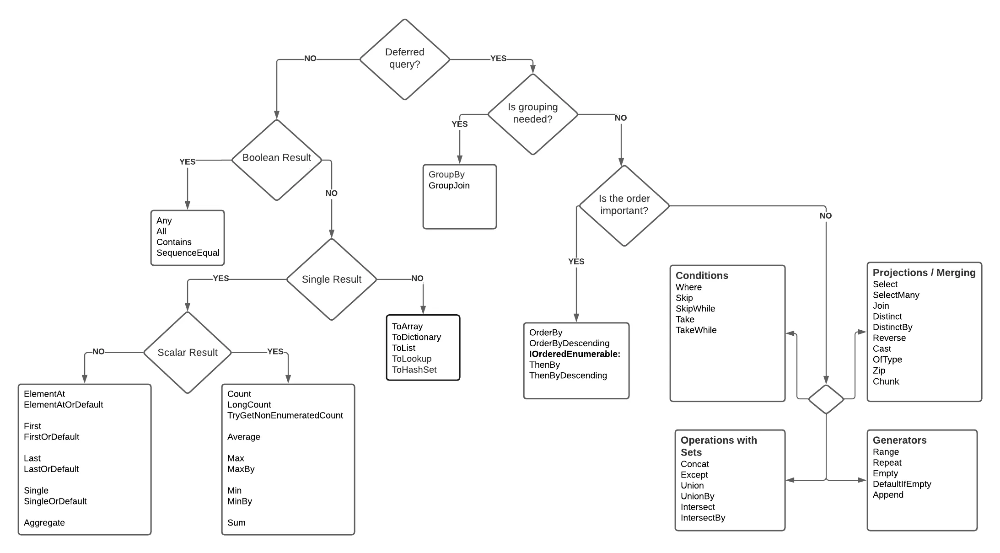

# Language Integrated Query (LINQ)

All LINQ query operations consist of three distinct actions:
*   Obtain the data source.
*   Create the query.
*   Execute the query.

```csharp
// The Three Parts of a LINQ Query:
// 1. Data source.
int[] numbers = [ 0, 1, 2, 3, 4, 5, 6 ];

// 2. Query creation.
// numQuery is an IEnumerable<int>
var numQuery =
    from num in numbers
    where (num % 2) == 0
    select num;

// 3. Query execution.
foreach (int num in numQuery)
{
    Console.Write("{0,1} ", num);
}
```
### Classification of standard query operators by manner of execution

#### Immediate
```csharp
var evenNumQuery =
    from num in numbers
    where (num % 2) == 0
    select num;

int evenNumCount = evenNumQuery.Count();
```
```csharp
List<int> numQuery2 =
    (from num in numbers
        where (num % 2) == 0
        select num).ToList();

// or like this:
// numQuery3 is still an int[]

var numQuery3 =
    (from num in numbers
        where (num % 2) == 0
        select num).ToArray();
```
#### Deferred
```csharp
foreach (int num in numQuery)
{
    Console.Write("{0,1} ", num);
}
```
#### Streaming
#### Nonstreaming

### Classification table
https://learn.microsoft.com/en-us/dotnet/csharp/linq/get-started/introduction-to-linq-queries#classification-table

### cheat sheet


Scalar result

bool

Any — Checks if there is at least one element in the collection that meets the condition

All — Checks if all elements in the collection meet the condition

Contains — Checks if the collection contains the element

SequenceEqual — Checks collections for equality

Numeric

Average — Returns the average value of a numeric collection

Count — Counts the number of elements in the collection

LongCount — Counts the number of elements in the collection as a long

TryGetNonEnumeratedCount — the same as Count, but with an attempt to do it without an extra pass through the sequence.

Min — Returns the minimum element of the collection

MinBy — The same as Min but with the additional condition.

Max — Returns the maximum element of the collection

MaxBy — The same as Max but with the additional condition.

Sum — Returns the sum of the collection’s elements

Non-scalar result

ElementAt — Returns the element at the given index

ElementAtOrDefault — Returns the element at the index or NULL if the element is not found

First — Returns the first element of the sequence or throws an exception if the element is not found

FirstOrDefault — Returns the first element of the sequence or NULL if the element is not found

Last — Returns the last element of the sequence or throws an exception if the element is not found

LastOrDefault — Returns the last element of the sequence or NULL if the element is not found

Single — Returns the only element in the collection or throws an exception if it is not present

SingleOrDefault — Returns the only element in the collection or NULL if the element does not exist. In the case of more than one element, we got an exception.

Aggregate — Returns a single element by pairwise merging elements in several passes

Projection Operations

Select — Projection with some pipeline processing of each element SelectMany — Combine a collection of lists into one list

Join — Combining lists based on some criteria

GroupJoin — A combination of join and groupby, allows to connect by key and get all values of the second sequence for the value of the first in the result forming function

Distinct — Removal of duplicates

Reverse — Reverse the sequence

Cast — Transformation, can be replaced with select

OfType — Filtering by type, can be replaced with select

GroupBy — Grouping by field

Operations on sets

Except — Take elements from the first that are not present in the second

Union — Unlike

Concat — combines without duplicates

Intersect — Elements at the intersection of two sequences

Zip — “Stitches” 2 or more sequences like a zip fastener, and the output gets an element for each sequential pair Filtering Operations

Where — Filtering by condition (logical predicate)

Skip — Skipping elements

SkipWhile — Skip while the condition is met

Take — Take N elements of the sequence

TakeWhile — Take elements as long as the condition is met

Chunk — breaking the sequence into multiple sequences

Sequence generators

Range — Generate values within a range

Repeat — Repeat value N times

Empty — Create an empty sequence

DefaultIfEmpty — Returns default(collection type) if the sequence is empty

Append —Add an element to the sequence